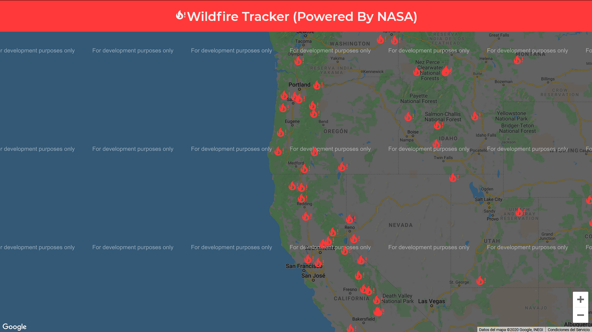

# Wildfire Tracker

A clone application based on Project of [bradtraversy](https://github.com/bradtraversy 'Brad Traversy')

## Live Preview

[Wildfire Tracker](https://wildfire-tracker-six.vercel.app/ 'Wildfire Tracker React App')

### Tech/framework used

<b>Built with</b>

-   [React](https://reactjs.org/)
-   [NASA API](https://api.nasa.gov/)

### Installation and Setup Instructions

Clone down this repository. You will need `node` and `npm` installed globally on your machine.

Installation: `npm install`

To Start Server: `npm start`

To Visit App: `localhost:3000/`

#### By **[a12989x](https://github.com/a12989x, 'Alexis Guzman')**
